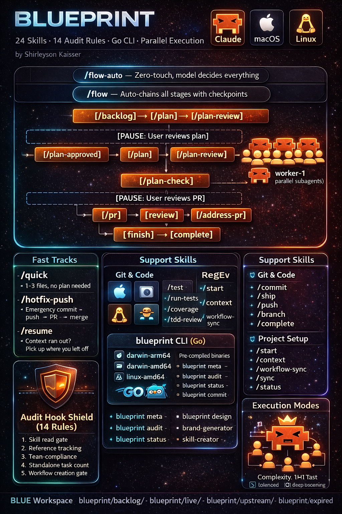

# BLUEPRINT SDLC

> One command. Your entire software development lifecycle — automated.

**Up to 200x faster. Fully automatic. Stack-agnostic. Zero paid dependencies.**

[](https://github.com/skaisser/blueprint#install) [](LICENSE) [](https://github.com/skaisser/blueprint)

> macOS + Linux · Apple Silicon + Intel · zsh + bash · Requires [Claude Code](https://claude.ai/claude-code)

<p align="center">
  
</p>

<p align="center">
  <a href="https://github.com/skaisser/blueprint/releases/latest"></a>
  
  
  
  
  
</p>

---

## The Problem

You know the drill. You open Claude Code, start a feature, and 45 minutes later you're debugging a context overflow because the model forgot what it was building. You've tried CLAUDE.md files, custom prompts, manual checklists — but none of it sticks. The model drifts. Tasks get skipped. Tests don't run. PRs go out half-baked.

**Claude Code is the most powerful coding tool ever built. But without structure, it's a Ferrari in a parking lot.**

BLUEPRINT gives it the road.

---

## What BLUEPRINT Does

BLUEPRINT turns Claude Code from a code assistant into a **disciplined engineering partner**. It wraps the entire software development lifecycle — from idea capture to merged PR — into a structured pipeline of slash commands, enforced by a compiled Go audit hook that fires on every single tool call.

The result? Features that used to take hours of back-and-forth now ship in minutes. **Not because the model is faster — because it never gets lost.**

> **GTD taught you to capture everything. BLUEPRINT ships it.**

### The Speed Difference

| Without BLUEPRINT | With BLUEPRINT |
|-------------------|---------------|
| Manually describe the task every session | `/plan` captures everything once — persists across sessions |
| Model forgets context mid-feature | Audit hook enforces the plan on every tool call |
| You babysit every step | `/flow-auto` runs the entire pipeline autonomously |
| One agent, sequential work | `/plan-approved` spawns parallel subagents — true concurrency |
| "Did I run the tests?" | Audit rule #8 blocks PRs without test runs |
| PRs with missing context | `/pr` auto-generates summary from the plan file |
| Features take 2-4 hours of Claude time | Same features in 5-15 minutes with parallel execution |

**Up to 200x faster isn't marketing — it's math.** When you split 20 tasks across 4 parallel subagents, each running at full speed with no context drift, the throughput is incomparable to one model doing everything sequentially while you re-explain the task every 10 minutes.

---

## Install

### Option 1: Claude Code Plugin (Recommended)

```
/plugin marketplace add skaisser/blueprint-plugin
/plugin install blueprint
```

2-second install. All 27 skills, audit hooks, MCP servers, and status line — active instantly.

### Option 2: Homebrew (CLI only)

```bash
brew tap skaisser/tap
brew install blueprint
```

Installs the CLI binary only. Use with the plugin for full functionality.

### Option 3: Manual (Legacy)

```bash
curl -fsSL https://raw.githubusercontent.com/skaisser/blueprint/refs/heads/main/install.sh | bash
```

Full install: binary + skills + hooks + settings + MCP servers.

### Migration from install.sh

If you previously installed via `curl | bash`, the plugin install works alongside it. Skills from the plugin take priority. To clean up the old install:

```bash
./install.sh --uninstall   # Remove old install
# Then install via plugin
```

### What you need

- [Claude Code](https://claude.ai/claude-code) installed and working
- `curl` and `git` (pre-installed on macOS and most Linux)

### Uninstall

Clean removal — keeps your other Claude Code settings intact:

```bash
./install.sh --uninstall
# or remotely:
bash <(curl -fsSL https://raw.githubusercontent.com/skaisser/blueprint/refs/heads/main/install.sh) --uninstall
```

### Verify

```bash
blueprint --version    # Should print: blueprint version v1.0.0
```

---

## What Gets Installed

The installer sets up everything in one shot — no menus, no choices, no dependencies. Both `curl | bash` and `./install.sh` install the same thing.

| Component | Target | What it does |
|-----------|--------|-------------|
| **Blueprint CLI** | `~/.blueprint/bin/blueprint` | Compiled Go binary — `blueprint audit`, `blueprint status`, `blueprint update`. Pre-built for macOS (arm64/amd64) and Linux (amd64). Zero runtime dependencies. |
| **27 SDLC skills** | `~/.claude/skills/` | The slash commands that drive the entire pipeline — from `/backlog` to `/finish`. Each skill is a self-contained prompt with its own references. |
| **Audit hook** (15 rules) | `settings.json` | Fires on every Claude Code tool call. Blocks dangerous commands, enforces test parallelism, requires plan-check before PR. |
| **Status line** | `~/.blueprint/statusline.sh` | Live display — model, context bar, estimated time remaining, git branch, code changes, session duration. |
| **Permissions** | `settings.json` | Pre-approves `git add`, `git push`, sequential-thinking MCP, and `/commit`. |
| **Agent Teams** | `settings.json` | Enables experimental coordinated teams — `/plan-approved` can spawn multiple workers. |
| **Plugins** | `settings.json` | ralph-loop (recurring tasks), skill-creator (build/test skills), playground (interactive HTML explorers). |
| **MCP servers** | `mcp.json` | Context7 (live docs for any library, free) + Sequential Thinking (structured reasoning). Both via npx, zero config. |
| **Git hooks** | `~/.blueprint/templates/` | `commit-msg` enforces emoji+type format. `pre-push` blocks pushes to main. Copied to projects via `/start`. |
| **GitHub Action** | `~/.blueprint/templates/` | `claude-pr-reviewer.yml` triggers @claude code review on PRs. Copied to projects via `/start`. |

All settings are **smart-merged** — the installer never overwrites your existing `settings.json` or `mcp.json`. It only adds missing sections. Existing files are backed up with timestamps before any modification.

---

## The Pipeline

Every letter in **BLUEPRINT** maps to a pipeline phase. This isn't a naming gimmick — it's how the system actually works:

| # | | Command | Phase | What happens |
|---|---|---------|-------|-------------|
| 1 | **B** | `/backlog` | **B**acklog | Capture idea → `blueprint/backlog/0001-feature.md` |
| 2 | **L** | `/plan` | **L**ayout | Create branch + blueprint file with phases, tasks, acceptance criteria |
| 3 | **U** | `/plan-review` | **U**npack | Assign `[H]`/`[S]`/`[O]` complexity, pick execution strategy, mark model tiers |
| 4 | **E** | `/plan-approved` | **E**ndorse | Spawn parallel subagents, execute phases, commit per phase |
| 5 | **P** | `/plan-check` | **P**reflight | Audit code vs blueprint — detect deleted tasks, orphaned refs, missing tests |
| 6 | **R** | `/pr` | **R**aise | Open PR with full context from the blueprint file |
| 7 | **I** | `/review` | **I**nspect | Trigger @claude code review via GitHub Action |
| 8 | **N** | `/address-pr` | **N**egotiate | Fetch review feedback, categorize, fix, push |
| 9 | **T** | `/finish` | **T**ag | Merge PR → move blueprint to `upstream/` |

### Skip the Steps — Let It Run

Don't want to drive? Let BLUEPRINT handle the entire pipeline:

```bash
/flow                 # Guided pipeline — pauses at review for your approval
/flow-auto            # Zero-touch — model decides everything, PR ready for merge
/batch-flow 2-6       # Execute blueprints 0002–0006 sequentially in one session
```

`/flow-auto` is the endgame: you describe what you want, walk away, and come back to a PR. The model plans, reviews its own plan, executes with parallel subagents, audits the result, opens the PR, and stops. **You just merge.**

---

## The BLUE Workspace

Your file path _is_ your status. No database, no dashboard — just folders:

| | Folder | Trigger | Meaning |
|---|--------|---------|---------|
| **B** | `blueprint/backlog/` | `/backlog` | Ideas not yet planned |
| **L** | `blueprint/live/` | `/plan` | Currently in development |
| **U** | `blueprint/upstream/` | `/finish` | Shipped and merged |
| **E** | `blueprint/expired/` | `/backlog --archive` | Cancelled or deferred |

Files move between folders automatically on each phase transition. Open `blueprint/` as an [Obsidian](https://obsidian.md) vault and your kanban is ready — Dataview compatible out of the box.

---

## Why BLUEPRINT?

### vs. Raw Claude Code

| Raw Claude Code | With BLUEPRINT |
|----------------|---------------|
| Great at coding, bad at process | Process is enforced — 15 audit rules on every tool call |
| Forgets what it's building after 50% context | Blueprint file is the persistent source of truth |
| You re-explain the task every session | `/resume` picks up exactly where it stopped |
| One agent, one task, sequential | Parallel subagents — 2-6 workers on independent phases |
| No commit discipline | Emoji+type format enforced, AI signatures blocked |
| "Did I test this?" | Audit rule blocks PRs without test runs |

### vs. Other Claude Code Workflows

| Other workflows | BLUEPRINT |
|----------------|-----------|
| Loose CLAUDE.md conventions | Compiled Go audit hook — not a suggestion, an enforcement |
| Manual slash commands you have to remember | 9-step pipeline where each step triggers the next |
| Single-agent execution | Multi-agent parallel execution with coordinated teams |
| Context overflow crashes your session | `/resume` recovers from any crash, context limit, or session break |
| No project structure | BLUE workspace — your folder structure is your kanban |

### vs. Not Using Claude Code at All

If you're still writing every line by hand, BLUEPRINT won't help you. But if you've adopted Claude Code and want to go from "useful assistant" to "autonomous engineering team" — this is the system.

---

## Execution Strategies

`/plan-review` analyzes your plan and automatically picks the fastest execution mode:

| Complexity | Meaning | Model |
|------------|---------|-------|
| `[H]` | Fast — config, styling, simple tests | Sonnet (fast output) |
| `[S]` | Balanced — business logic, services | Opus (maximum quality) |
| `[O]` | Deep reasoning — architecture decisions | Opus (full context) |

| Strategy | When | How |
|----------|------|-----|
| **Parallel Subagents** *(default)* | 2+ independent phases | Multiple Agent calls in one message — true parallelism |
| **Coordinated Team** | Workers need mid-task handoffs | Team messaging between agents |
| **Single Subagent** | 1 phase or strictly sequential | One Agent call, no spawn overhead |
| **Leader Direct** | ≤3 `[H]` tasks total | Lead model handles directly — no agent spawn |

---

## All 27 Skills

| Category | Skills | What they do |
|----------|--------|-------------|
| **Pipeline** | `/backlog` `/plan` `/plan-review` `/plan-approved` `/plan-check` `/pr` `/review` `/address-pr` `/finish` | The full BLUEPRINT pipeline — idea to merged PR |
| **Automation** | `/flow` `/flow-auto` `/flow-auto-wt` `/batch-flow` | Run the pipeline automatically — guided or fully autonomous |
| **Fast Tracks** | `/quick` `/hotfix` `/resume` | Small fixes without planning, emergency deploys, crash recovery |
| **Git & PR** | `/bp-commit` `/bp-ship` `/bp-push` `/bp-branch` | Git operations with safety checks and emoji format |
| **Testing** | `/bp-test` `/bp-tdd-review` | Create Pest tests, restructure plans for TDD |
| **Project Setup** | `/start` `/bp-context` `/bp-status` `/complete` | Initialize projects, generate CLAUDE.md, show status |
| **Skill Factory** | `/skill-creator` | Build, test, benchmark, and optimize new skills |

---

## Audit Hook — 15 Rules

`blueprint audit` fires on **every Claude Code tool call** via PreToolUse. It's a compiled Go binary — fast, zero dependencies, impossible to skip.

| # | Rule | What it catches |
|---|------|----------------|
| 1 | Skill read gate | Writing code without reading the relevant SKILL.md first |
| 2 | Reference tracking | Skipping key reference files before implementation |
| 3 | Team compliance | Using teams without reading team-execution.md |
| 4 | Standalone task count | 3+ tasks without spawning a team |
| 5 | Handoff tracking | Missing checkpoints at `/flow` pauses |
| 6 | Checkpoint audit trail | Skipping `/plan-check` before `/pr` |
| 7 | Workflow creation gate | Creating CI workflows without a staging branch |
| 8 | Test suite enforcement | Running tests without `--parallel` or `--filter` |
| 9 | Plan task deletion | Agents deleting tasks instead of implementing them |
| 10 | Dangerous command block | `migrate:fresh`, AI signatures, direct push to main |
| 11 | Review enforcement | Short `@claude review` comments — require full prompts |
| 12 | Plan-check skip | Opening a PR without running `/plan-check` |
| 13 | Acceptance criteria | PR with unchecked acceptance criteria |
| 14 | Flow-auto enforcement | Skipping mandatory pipeline steps |
| 15 | Backlog CLI enforcement | Manual file parsing instead of `blueprint backlog` |

---

## Commit Format

Every commit follows emoji+type format, enforced by the `commit-msg` hook. AI signatures (`Co-Authored-By`, `Generated by Claude`) are automatically blocked.

```
<emoji> <type>: <description>   (present tense, lowercase)
```

| Emoji | Type | Use case |
|-------|------|----------|
| ✨ | `feat` | New feature |
| 🐛 | `fix` | Bug fix |
| 📚 | `docs` | Documentation |
| ♻️ | `refactor` | Restructuring, no behavior change |
| 🧪 | `test` | Tests only |
| 📋 | `plan` | Blueprint file updates |
| 🔀 | `merge` | Branch merge |
| 🩹 | `hotfix` | Urgent production fix |
| 🚀 | `deploy` | Deployment / CI |

---

## Platforms

| Binary | Platform | Arch |
|--------|----------|------|
| `blueprint-darwin-arm64` | macOS | Apple Silicon (M1–M4) |
| `blueprint-darwin-amd64` | macOS | Intel |
| `blueprint-linux-amd64` | Linux | x86_64 |

---

## Roadmap

| Version | Scope |
|---------|-------|
| **v1.0** ✅ | 27 SDLC skills · `blueprint` CLI · 15-rule audit hook · Obsidian BLUE workspace |
| v1.1 | Laravel TALL preset · Node/TS preset |
| v1.2 | Standalone skills as optional add-ons |
| v1.3 | Autoresearch eval dashboard + optimizer |
| v2.0 | Improved multi-agent execution · inter-agent blueprint handoffs |

---

## License

Apache 2.0 — use freely, build openly. See [LICENSE](LICENSE) for details.

---

<p align="center">
  Made with ❤️ by <a href="https://github.com/skaisser">Shirleyson Kaisser</a>
</p>

<p align="center">
  <a href="https://github.com/skaisser/blueprint">⭐ Star this repo if BLUEPRINT makes you ship faster</a>
</p>
