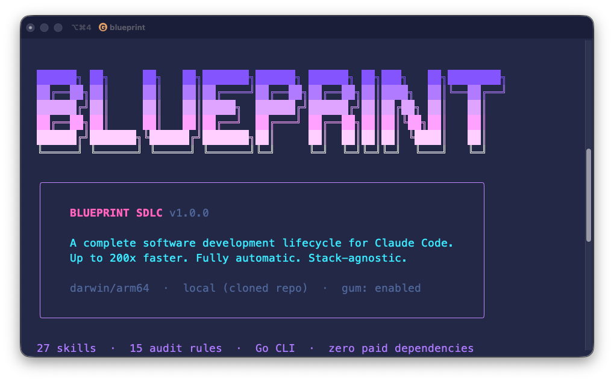

# BLUEPRINT SDLC

> One command. Complete software development lifecycle for Claude Code.

**Up to 200x faster. Fully automatic. Stack-agnostic. Zero paid dependencies.**

[](https://github.com/skaisser/blueprint#install) [](LICENSE)

> macOS + Linux · Apple Silicon + Intel · zsh + bash · Requires [Claude Code](https://claude.ai/claude-code)

<p align="center">
  
</p>

<p align="center">
  <a href="https://github.com/skaisser/blueprint/releases/latest"></a>
  
  
  
  
  
</p>

---

BLUEPRINT turns Claude Code from a code assistant into a disciplined engineering partner — with planning, execution, review, and merge all governed by a structured pipeline of slash commands, an audit hook enforcing 15 rules on every tool call, and a Go CLI binary shipping pre-compiled for macOS and Linux.

> If you've tried GTD-style workflows with Claude Code, you know the pain: too slow, too manual, too much overhead. BLUEPRINT fixes that.
>
> **GTD taught you to capture everything. BLUEPRINT ships it.**

---

## Install

### One command — works on macOS and Linux

Open **any terminal** (Terminal.app, iTerm2, Warp, Alacritty, etc.) and paste:

```bash
curl -fsSL https://raw.githubusercontent.com/skaisser/blueprint/refs/heads/main/install.sh | bash
```

> **Using zsh?** Yes, this works perfectly on zsh (macOS default), bash, and any POSIX shell. The `| bash` part tells the system to run the script with bash — your shell stays untouched.

<p align="center">
  
</p>

The installer auto-detects your platform, bootstraps [gum](https://github.com/charmbracelet/gum) for a beautiful TUI, and walks you through component selection. Everything is pre-selected by default — just hit Enter to accept all, or press `n` to skip any component.

**What you need before installing:**
- [Claude Code](https://claude.ai/claude-code) installed and working
- `curl` and `git` (both come pre-installed on macOS and most Linux distros)
- Homebrew (macOS) — for auto-installing gum. If missing, gum is fetched directly

### Clone (contributors / CLI hackers)

```bash
git clone git@github.com:skaisser/blueprint.git ~/Sites/blueprint
cd ~/Sites/blueprint && ./install.sh
```

```bash
cd cli && make build-all   # builds arm64 · amd64 · linux
```

### Uninstall

```bash
./install.sh --uninstall
# or remotely:
bash <(curl -fsSL https://raw.githubusercontent.com/skaisser/blueprint/refs/heads/main/install.sh) --uninstall
```

Removes `~/.blueprint/`, Blueprint skills from `~/.claude/skills/`, and the audit hook from settings — your other Claude Code settings are preserved.

---

## What gets installed

The installer has a **component picker** — core items always install, everything else is toggleable. All components are pre-selected by default.

### Core (always installed)

| Component | Target | What it does |
|-----------|--------|-------------|
| **Blueprint CLI binary** | `~/.blueprint/bin/blueprint` | Go binary — runs `blueprint audit`, `blueprint status`, `blueprint update`. Pre-compiled for macOS (arm64/amd64) and Linux. |
| **27 SDLC skills** | `~/.claude/skills/` | Slash commands that drive the entire pipeline — from `/backlog` to `/finish`. |

### Optional components

Toggle with Space, confirm with Enter. All pre-selected by default.

#### Audit hook — 15 rules (recommended)

| | |
|---|---|
| **Target** | `~/.claude/settings.json` |
| **What it does** | Fires on every Claude Code tool call via PreToolUse. Enforces skill read gates, test parallelism, plan-check before PR, blocks dangerous commands, and 11 more rules. Fast, compiled Go binary — zero runtime dependencies. |

#### Status line — context/git/duration bar (recommended)

| | |
|---|---|
| **Target** | `~/.blueprint/statusline.sh` + `~/.claude/settings.json` |
| **What it does** | Live display in your Claude Code prompt — model name, visual context bar (green/yellow/red), estimated time remaining, session duration, git branch with ahead/behind, code changes (+/-), and current folder. |

#### Permissions — git push, sequential-thinking

| | |
|---|---|
| **Target** | `~/.claude/settings.json` |
| **What it does** | Pre-approves `git add`, `git push`, sequential-thinking MCP, and `/commit` so Claude Code doesn't prompt for permission on every git operation. |

#### Agent Teams — experimental

| | |
|---|---|
| **Target** | `~/.claude/settings.json` |
| **What it does** | Enables `CLAUDE_CODE_EXPERIMENTAL_AGENT_TEAMS` — allows `/plan-approved` to spawn coordinated teams of workers for parallel execution. |

#### Plugins — ralph-loop, skill-creator, playground

| | |
|---|---|
| **Target** | `~/.claude/settings.json` |
| **What it does** | Enables three Claude Code plugins: **ralph-loop** (recurring task runner), **skill-creator** (build/test/optimize skills), **playground** (interactive HTML explorers). |

#### MCP servers — Context7, Sequential Thinking

| | |
|---|---|
| **Target** | `~/.claude/mcp.json` |
| **What it does** | **Context7** — live documentation lookup for any library (free, no API key). **Sequential Thinking** — structured reasoning for complex planning. Both run via npx, zero config. |

#### Git hook templates

| | |
|---|---|
| **Target** | `~/.blueprint/templates/.githooks/` |
| **What it does** | `commit-msg` hook enforces emoji+type format on every commit. `pre-push` hook blocks pushes to main/master. Copied to projects via `/start`. |

#### GitHub Action templates

| | |
|---|---|
| **Target** | `~/.blueprint/templates/.github/` |
| **What it does** | `claude-pr-reviewer.yml` — triggers `@claude` code review on PRs. `tests.yml` — CI test runner template. Copied to projects via `/start`. |

---

## The Pipeline

Every letter in **BLUEPRINT** maps to a pipeline phase:

| # | | Command | Phase |
|---|---|---------|-------|
| 1 | **B** | `/backlog` | **B**acklog — capture and prioritise ideas |
| 2 | **L** | `/plan` | **L**ayout — create branch + blueprint file |
| 3 | **U** | `/plan-review` | **U**npack — validate, assign complexity |
| 4 | **E** | `/plan-approved` | **E**ndorse — execute, spawn parallel subagents |
| 5 | **P** | `/plan-check` | **P**reflight — audit code vs blueprint |
| 6 | **R** | `/pr` | **R**aise — open pull request with full context |
| 7 | **I** | `/review` | **I**nspect — trigger @claude code review |
| 8 | **N** | `/address-pr` | **N**egotiate — fetch feedback, fix, push |
| 9 | **T** | `/finish` | **T**ag — merge, rename blueprint to `upstream/` |

---

## The BLUE Workspace

The `blueprint/` directory uses the first four letters as folder names — your file path _is_ your status:

| | Folder | Trigger | Meaning |
|---|--------|---------|---------|
| **B** | `blueprint/backlog/` | `/backlog` | Ideas not yet planned |
| **L** | `blueprint/live/` | `/plan` | Currently in development |
| **U** | `blueprint/upstream/` | `/finish` | Shipped and merged |
| **E** | `blueprint/expired/` | `/backlog --archive` | Cancelled or deferred |

Files move between folders automatically on each phase transition. Compatible with [Obsidian](https://obsidian.md) + Dataview out of the box — open `blueprint/` as a vault and your kanban is ready.

---

## Quick Start

### 1. Initialize a project

```bash
/start
```

Sets up git hooks, CLAUDE.md, `blueprint/` workspace (BLUE folders), GitHub Action, and a configurable staging branch.

### 2. Run the full pipeline

```bash
/backlog              # Capture idea → blueprint/backlog/0001-feature.md
/plan                 # Promote → blueprint/live/0001-feature.md + git branch
/plan-review          # Validate, assign complexity, pick execution strategy
/plan-approved        # Execute — spawn parallel subagents
/plan-check           # Audit code vs blueprint
/pr                   # Open pull request
/review               # Trigger @claude code review
/address-pr           # Fetch feedback, fix, push
/finish               # Merge → blueprint/upstream/0001-feature-complete.md
```

### 3. Or let it run itself

```bash
/flow                 # Guided pipeline with 2 review pauses
/flow-auto            # Zero-touch — model decides everything, PR ready for merge
/batch-flow 2-6       # Execute blueprints 0002–0006 sequentially
```

---

## Why BLUEPRINT?

| Before | BLUEPRINT |
|--------|-----------|
| Manual task capture | `/backlog` — one command, file created instantly |
| You manage the system | Audit hook enforces the system for you |
| Context switches kill flow | 1M context + `/flow` keeps everything in one session |
| Folders you maintain by hand | BLUE folders move automatically on phase transitions |
| Trust yourself to follow the process | 15 rules catch you when you don't |
| Someday/Maybe pile | `blueprint/expired/` — archived, not lost |

---

## All 27 Skills

| Category | Skills |
|----------|--------|
| Pipeline | `/backlog` `/plan` `/plan-review` `/plan-approved` `/plan-check` `/pr` `/review` `/address-pr` `/finish` |
| Automation | `/flow` `/flow-auto` `/flow-auto-wt` `/batch-flow` |
| Fast Tracks | `/quick` `/hotfix` `/resume` |
| Git & PR | `/bp-commit` `/bp-ship` `/bp-push` `/bp-branch` |
| Testing | `/bp-test` `/bp-tdd-review` |
| Project Setup | `/start` `/bp-context` `/bp-status` `/complete` |
| Skill Factory | `/skill-creator` |

---

## Execution Strategies

`/plan-review` assigns complexity and picks the fastest execution mode automatically:

| Complexity | Meaning |
|------------|---------|
| `[H]` | Fast — small scope, execute immediately |
| `[S]` | Balanced — standard parallel execution |
| `[O]` | Deep reasoning — sequential, full context required |

| Strategy | When | How |
|----------|------|-----|
| Parallel Subagents *(default)* | 2+ independent phases | Multiple Agent calls in one message — true parallelism |
| Coordinated Team | Workers need mid-task handoffs | Team messaging between agents |
| Single Subagent | 1 phase or strictly sequential | One Agent call, no spawn overhead |
| Leader Direct | ≤3 `[H]` tasks total | Lead model handles directly |

---

## Audit Hook — 15 Rules

`blueprint audit` fires on every Claude Code tool call via PreToolUse. The Go binary is the only hook — fast, compiled, zero dependencies.

| # | Rule | What it enforces |
|---|------|-----------------|
| 1 | Skill read gate | Block writes without reading relevant SKILL.md |
| 2 | Reference tracking | Track reads of key reference files |
| 3 | Team compliance | Warn if teams used without reading team-execution.md |
| 4 | Standalone task count | Warn if 3+ tasks with no team |
| 5 | Handoff tracking | Track checkpoints at `/flow` pauses |
| 6 | Checkpoint audit trail | Enforce `/plan-check` before `/pr` |
| 7 | Workflow creation gate | Block `claude-pr-reviewer.yml` without a staging branch |
| 8 | Test suite enforcement | Block test runner without `--parallel` or `--filter` |
| 9 | Plan task deletion | Warn when unchecked tasks removed instead of implemented |
| 10 | Dangerous command block | Block `migrate:fresh`, AI signatures, direct push to main |
| 11 | Review enforcement | Block short `@claude review` — require full prompt |
| 12 | Plan-check skip detection | Warn if `/pr` invoked without `/plan-check` |
| 13 | Acceptance criteria gate | Warn if PR has unchecked acceptance criteria |
| 14 | Flow-auto enforcement | Block PR if mandatory steps were skipped |
| 15 | Backlog CLI enforcement | Block manual backlog file parsing — use `blueprint backlog` CLI |

---

## Commit Format

BLUEPRINT enforces emoji + type on every commit via the `commit-msg` hook. AI signatures (`Co-Authored-By`, `Generated by Claude`) are blocked.

```
<emoji> <type>: <description>   (present tense, lowercase)
```

| Emoji | Type | Use case |
|-------|------|----------|
| ✨ | `feat` | New feature |
| 🐛 | `fix` | Bug fix |
| 📚 | `docs` | Documentation |
| ♻️ | `refactor` | Restructuring, no behavior change |
| 🧪 | `test` | Tests only |
| 📋 | `plan` | Blueprint file updates |
| 🔀 | `merge` | Branch merge |
| 🩹 | `hotfix` | Urgent production fix |
| 🚀 | `deploy` | Deployment / CI |

---

## Blueprint Frontmatter

Every blueprint file is Obsidian + Dataview compatible:

```yaml
---
id: 0002
title: Auth flow refactor
type: feature
status: live              # backlog | live | upstream | expired
issue: null
branch: feat/auth-flow-refactor
base: main
strategy: parallel
session: null
pr: null
created: "20/03/2026 14:00"
completed: null
tags: [auth, security]
---
```

```dataview
TABLE type, issue, created
FROM "blueprint/live"
SORT created DESC
```

---

## Platforms

| Binary | Platform | Arch |
|--------|----------|------|
| `blueprint-darwin-arm64` | macOS | Apple Silicon (M1–M4) |
| `blueprint-darwin-amd64` | macOS | Intel |
| `blueprint-linux-amd64` | Linux | x86_64 |

---

## Roadmap

| Version | Scope |
|---------|-------|
| **v1.0** | 27 SDLC skills · `blueprint` CLI · 15-rule audit hook · Obsidian BLUE workspace |
| v1.1 | Laravel TALL preset · Node/TS preset |
| v1.2 | Standalone skills as optional add-ons |
| v1.3 | Autoresearch eval dashboard + optimizer |
| v2.0 | Improved multi-agent execution · inter-agent blueprint handoffs |

---

## License

Apache 2.0 — use freely, build openly. See [LICENSE](LICENSE) for details.

---

<p align="center">
  Made with ❤️ by <a href="https://github.com/skaisser">Shirleyson Kaisser</a>
</p>
